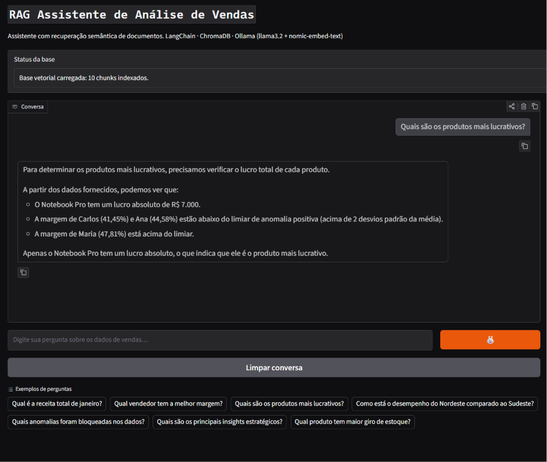
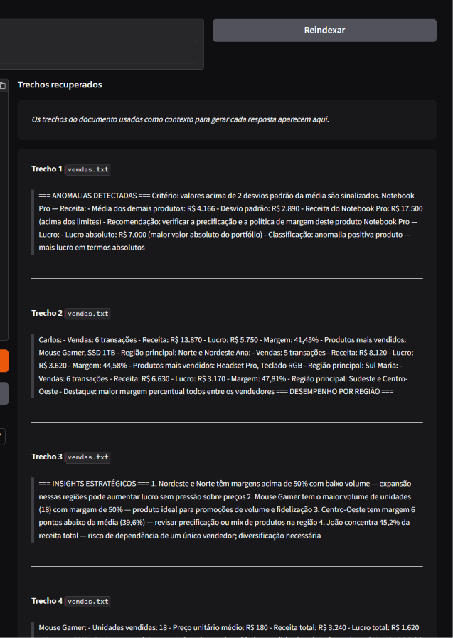
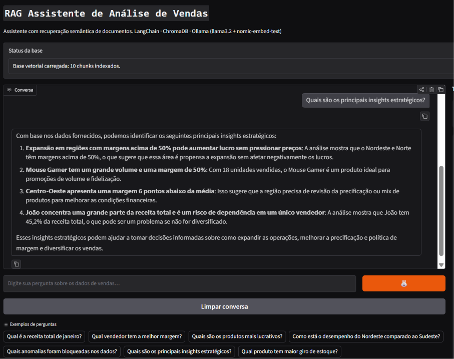

# `RAG Assistente de Análise de Vendas`

> Sistema RAG (Retrieval-Augmented Generation) com interface web, histórico de conversa e exibição dos trechos recuperados. LangChain, ChromaDB e Ollama rodando 100% localmente.

---

## `Tecnologias`


---

## `O que faz`

Indexa documentos `.txt` e `.pdf` em um banco vetorial local (ChromaDB), busca os trechos semanticamente mais relevantes para cada pergunta e usa o llama3.2 (via Ollama) para gerar respostas fundamentadas exclusivamente no conteúdo indexado. A interface Gradio exibe a resposta, os trechos recuperados e mantém histórico da conversa. Sem alucinação, sem API paga, 100% local.

---

## `Arquitetura`

```
Documentos (.txt / .pdf)
    RecursiveCharacterTextSplitter (chunk=600, overlap=120)
        nomic-embed-text (Ollama) → vetores
            ChromaDB (disco) → banco vetorial persistente

Pergunta do usuário + histórico
    nomic-embed-text → vetor da pergunta
        ChromaDB → top-4 chunks por similaridade coseno
            llama3.2 (Ollama) → resposta fundamentada no contexto
                Gradio → interface web com fontes visíveis
```

---

## `Fluxo RAG`

```
app.py (Gradio Blocks)
    │
    ├── ao iniciar: src/rag.py → carregar_banco() ou indexar()
    │
    └── ao perguntar: src/rag.py → consultar(pergunta, db, historico)
            ├── retriever.invoke(pergunta) → 4 chunks relevantes
            ├── prompt com historico + contexto + pergunta
            └── llm.invoke() → resposta em linguagem natural
```

---

## `Estrutura`

```
rag_assistente/
├── src/
│   ├── __init__.py
│   └── rag.py           # indexar(), carregar_banco(), consultar()
├── dados/
│   ├── vendas.txt       # relatório de vendas (documento de exemplo)
│   └── chroma/          # banco vetorial gerado (gitignored)
├── docs/
│   └── screenshots/
├── app.py               # interface Gradio com chat + fontes + upload
├── requirements.txt
├── .gitignore
└── README.md
```

---

## `Interface`

| Componente | Função |
|---|---|
| Chat (esquerda) | Conversa com histórico das últimas 3 trocas como contexto |
| Trechos recuperados (direita) | Exibe os 4 chunks usados como contexto para a resposta |
| Exemplos | 7 perguntas pré-definidas para demonstração imediata |
| Adicionar documento | Upload de `.txt` ou `.pdf` para indexação na base |
| Reindexar | Rebuilda o ChromaDB com todos os documentos em `dados/` |

---

## `Configurações do pipeline`

| Parâmetro | Valor | Motivo |
|---|---|---|
| `chunk_size` | 600 | Preserva contexto suficiente sem fragmentar frases |
| `chunk_overlap` | 120 | Evita perda de informação nas bordas dos chunks |
| `top_k` | 4 | Recupera 4 trechos: equilíbrio entre recall e tamanho do prompt |
| `historico` | últimas 3 trocas | Contexto conversacional sem estourar a janela do LLM |
| Embeddings | `nomic-embed-text` | Modelo local otimizado para recuperação semântica em PT |
| LLM | `llama3.2` | Modelo local leve com boa capacidade de seguir instruções |

---

## `Pré-requisitos`

- Python 3.10+
- [Ollama](https://ollama.com) instalado e rodando

---

## `Instalação`

```bash
git clone https://github.com/Arthur-Baptista-dos-Santos/rag_assistente.git
cd rag_assistente

python -m venv .venv
.venv\Scripts\activate       # Windows
# source .venv/bin/activate  # Linux/Mac

pip install -r requirements.txt

ollama pull llama3.2
ollama pull nomic-embed-text
```

---

## `Como usar`

```bash
# Garanta que o Ollama está rodando
ollama serve

# Suba a interface web
python app.py
```

Acesse `http://127.0.0.1:7860`. A base vetorial é indexada automaticamente na primeira execução.

**Para adicionar seus próprios documentos:**
1. Use o painel "Adicionar documento" na interface, ou copie o arquivo para `dados/`
2. Clique em **Reindexar** para regenerar os embeddings

---

## `Conceitos aplicados`

- **`RAG`**: recupera contexto real dos documentos antes de gerar resposta, eliminando alucinações e fundamentando as respostas em dados verificáveis
- **`Embeddings`**: representação vetorial densa de texto que captura semântica, não apenas palavras-chave
- **`Similaridade cosseno`**: métrica usada pelo ChromaDB para encontrar os trechos mais próximos da pergunta no espaço vetorial
- **`Chunking com overlap`**: divide documentos em pedaços menores com sobreposição para não perder contexto nas bordas
- **`Histórico conversacional`**: as últimas 3 trocas são incluídas no prompt para que o LLM resolva pronomes e referências cruzadas
- **`LCEL`**: (LangChain Expression Language) pipeline declarativo com operador `|`, ex: `prompt | llm | parser`
- **`ChromaDB persistente`**: banco vetorial salvo em disco, sem necessidade de reindexar a cada reinício
- **`Ollama`**: servidor local de LLMs, sem custo de API e com privacidade total dos dados
- **`Gradio Blocks`**: layout customizado com múltiplos componentes, mais flexível que o ChatInterface padrão

---

## `Demonstração`

**Chat com resposta fundamentada**: pergunta "Quais são os produtos mais lucrativos?". O modelo responde citando dados reais do documento sem alucinar.



---

**Trechos recuperados**: os 4 chunks mais similares à pergunta são exibidos com a fonte (`vendas.txt`) e o conteúdo exato usado como contexto pelo LLM.



---

**Pergunta de follow-up com insights estratégicos**: segunda pergunta na mesma sessão, com histórico das últimas trocas incluído no prompt.



---

## `Licença`

Distribuído sob a licença MIT. Veja [LICENSE](LICENSE) para mais informações.

---

## `Autor`

**Arthur Baptista dos Santos**
RM 565346 · Inteligência Artificial · FIAP 2025-2026

[](https://linkedin.com/in/arthur-baptista-dos-santos)
[](https://github.com/Arthur-Baptista-dos-Santos)
